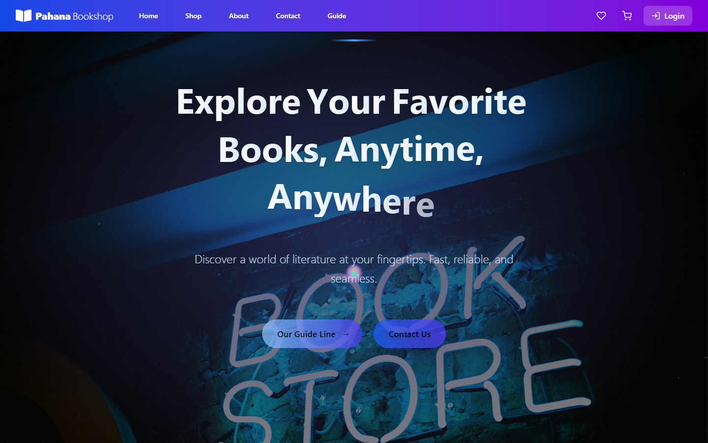
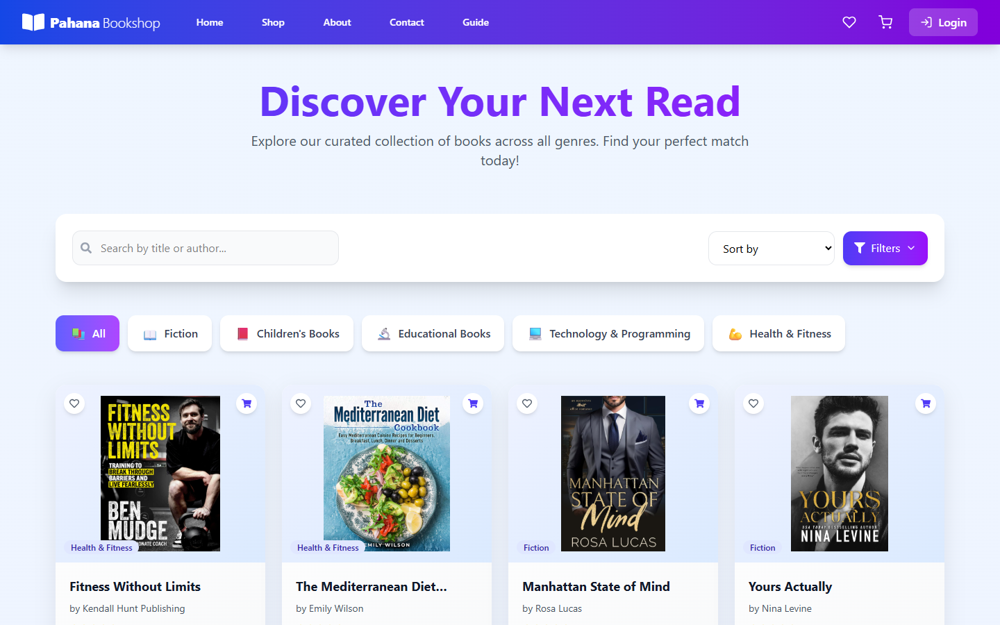
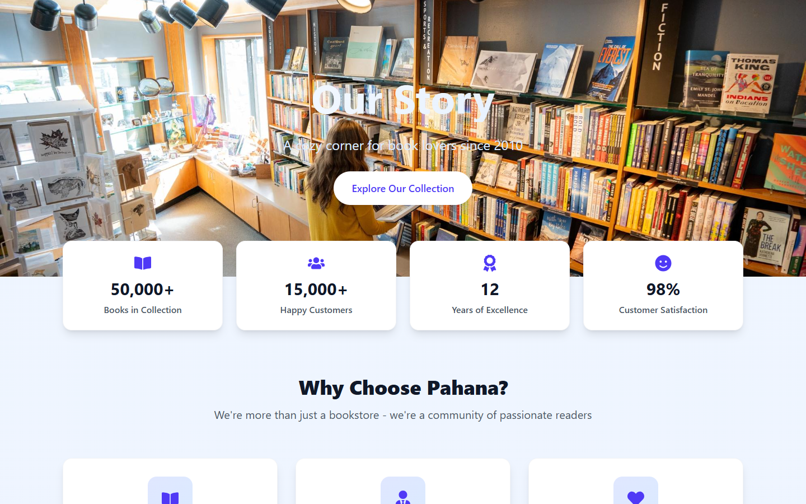

# 📚 Pahana Book Shop

> **Full-Stack E-Commerce Web Application for Book Ordering & Inventory Management**

Pahana Book Shop is a modern, responsive e-commerce web application designed for browsing, searching, and purchasing books online. It features a complete user portal for shoppers and an administrative dashboard for inventory and order management.

---

## 🖼️ Application Screenshots

### 🏠 **Home Page**


### 📚 **Book Catalog / Shop**


### 🔑 **User Login & Authentication**


### ℹ️ **About Us**


---

## 🚀 Technologies Used

### **Frontend**
* **Framework / Library:** React 19 + Vite
* **Styling:** Tailwind CSS v4 + Framer Motion (Animations)
* **Routing:** React Router DOM v7
* **HTTP Client:** Axios
* **UI Components & Icons:** React Icons, Swiper (Carousels), React Toastify
* **PDF & Invoice Generation:** jsPDF + jsPDF-AutoTable
* **Email Service:** EmailJS (`@emailjs/browser`)

### **Backend**
* **Framework:** Java 17 + Spring Boot 3.5.3
* **Modules:** Spring Web, Spring Data MongoDB, Spring Mail, DevTools
* **Utilities:** Lombok, Apache Commons FileUpload, SendGrid Java SDK
* **Database:** MongoDB (`mongodb://localhost:27017/Pahana`)

---

## ✨ Key Features

### 👤 **User Portal**
* **User Authentication:** User registration with profile image upload, login, profile view & update.
* **Book Catalog:** Browse books by category, new arrivals, search & view detailed book info.
* **Shopping Cart & Wishlist:** Add/remove items, update item quantities, and save wishlist items.
* **Checkout & Payment Flow:** Secure order placement with customer address & payment details.
* **Invoice & Email Notifications:** Instant PDF invoice downloads upon order completion and email notifications.
* **Order History:** View confirmed and pending user orders.

### 🛡️ **Admin Dashboard**
* **Admin Authentication:** Secure admin registration & login.
* **Book Inventory Management:** Add, update, delete, and view all books with image upload support.
* **User Management:** View all registered users, update profiles, or delete user accounts.
* **Order Management:** View all customer orders, filter by status, track order details, and update order statuses.

---

## 📂 Project Structure

```text
Pahana_Book_Shop/
├── Backend/                            # Spring Boot Backend Project
│   ├── src/main/java/com/Pahana_edu/Backend/
│   │   ├── controller/                 # REST Controllers (Admin, Book, Checkout, Email, User)
│   │   ├── entity/                     # MongoDB Documents / Entities (Book, Order, User, Admin)
│   │   ├── repository/                 # Spring Data MongoDB Repositories
│   │   ├── service/                    # Business Logic Services
│   │   └── webconfiguration/           # CORS & SendGrid Configuration
│   ├── src/main/resources/
│   │   └── application.properties      # MongoDB & File upload properties
│   └── uploads/                        # Uploaded book & profile images
│
├── Front_end/                          # React + Vite Frontend Project
│   ├── public/                         # Public static assets
│   ├── src/
│   │   ├── Admin/                      # Admin pages (Dashboard, Add/Manage Books, Orders, Users)
│   │   ├── Components/                 # Shared UI components (Header, Navbar, Footer, About, Contact)
│   │   ├── Pages/                      # User pages (Home, Shop, BookDetails, Cart, Checkout, Profile)
│   │   ├── App.jsx                     # Main application routing
│   │   └── main.jsx                    # React entry point
│   ├── package.json
│   └── vite.config.js
├── screenshots/                        # Application screenshots for README
└── README.md                           # Project documentation
```

---

## 🌐 REST API Endpoints

### 🔐 Auth & User Management (`/api/auth/`)
| Method | Endpoint | Description |
| :--- | :--- | :--- |
| `POST` | `/api/auth/register` | Register a new user (supports `profileImage` upload) |
| `POST` | `/api/auth/login` | User authentication |
| `GET` | `/api/auth/users` | Get list of all registered users |
| `GET` | `/api/auth/users/{username}` | Get user details by username |
| `GET` | `/api/auth/users/id/{id}` | Get user details by user ID |
| `PUT` | `/api/auth/users/{username}` | Update user profile details |
| `DELETE` | `/api/auth/users/{username}` | Delete user account |

### 📖 Book Inventory (`/api/books`)
| Method | Endpoint | Description |
| :--- | :--- | :--- |
| `GET` | `/api/books` | Fetch all books in catalog |
| `POST` | `/api/books/add` | Add a new book (with image upload) |
| `PUT` | `/api/books/{id}` | Update existing book details |
| `DELETE` | `/api/books/{id}` | Remove book from inventory |

### 🛒 Orders & Checkout (`/api/checkout`)
| Method | Endpoint | Description |
| :--- | :--- | :--- |
| `POST` | `/api/checkout` | Place a new order |
| `GET` | `/api/checkout` | Get all customer orders (Admin view) |
| `GET` | `/api/checkout/{id}` | Get order details by order ID |
| `GET` | `/api/checkout/u/{userId}/confirmed` | Get confirmed orders for a specific user |
| `PUT` | `/api/checkout/{id}` | Update order status / details |
| `DELETE` | `/api/checkout/{id}` | Cancel / delete order |

### 🔑 Admin Management (`/admin`)
| Method | Endpoint | Description |
| :--- | :--- | :--- |
| `POST` | `/admin/register` | Register new admin account |
| `POST` | `/admin/login` | Admin login authentication |
| `GET` | `/admin/all` | View list of all administrators |
| `PUT` | `/admin/update/{username}` | Update admin profile details |
| `DELETE` | `/admin/delete/{username}` | Delete admin account |

### ✉️ Email Service (`/api/v1/`)
| Method | Endpoint | Description |
| :--- | :--- | :--- |
| `POST` | `/api/v1/sendemail` | Send email notification |

---

## 🛠️ Setup & Installation Guide

### **Prerequisites**
Make sure you have the following installed on your machine:
* **JDK 17** or higher
* **Node.js** (v18 or higher) & **npm**
* **MongoDB Server** (Running locally on default port `27017` or configured remote URI)
* **Maven** (optional, wrapper `./mvnw` is included in the project)

---

### 🟢 1. Setting Up the Backend

1. **Navigate to the Backend directory:**
   ```bash
   cd Backend
   ```

2. **Configure MongoDB Connection (Optional):**
   Open `src/main/resources/application.properties` and update the database URI if necessary:
   ```properties
   spring.application.name=pahana_edu
   spring.data.mongodb.uri=mongodb://localhost:27017/Pahana
   file.upload-dir=uploads/
   server.port=8080
   ```

3. **Run the Spring Boot application:**
   - On Linux/macOS:
     ```bash
     ./mvnw spring-boot:run
     ```
   - On Windows (PowerShell):
     ```powershell
     .\mvnw.cmd spring-boot:run
     ```

   *The server will start at `http://localhost:8080`.*

---

### 🔵 2. Setting Up the Frontend

1. **Navigate to the Frontend directory:**
   ```bash
   cd Front_end
   ```

2. **Install project dependencies:**
   ```bash
   npm install
   ```

3. **Start the development server:**
   ```bash
   npm run dev
   ```

   *The React web app will open at `http://localhost:5173`.*

---

## 📄 License & Attribution

This project is created for **Pahana Edu Book Shop**. All rights reserved.
